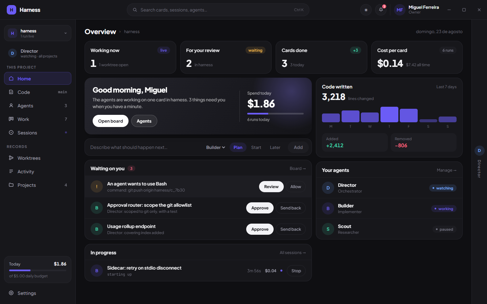
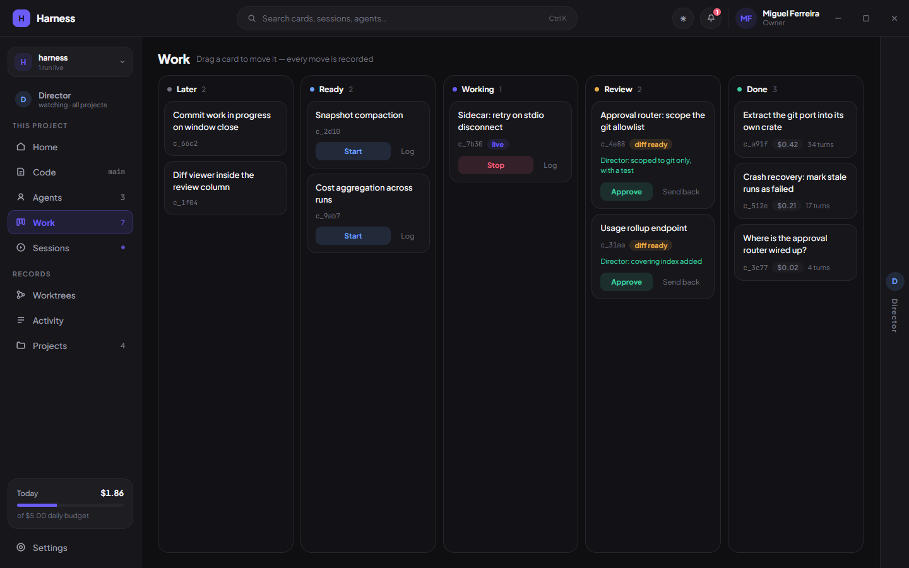
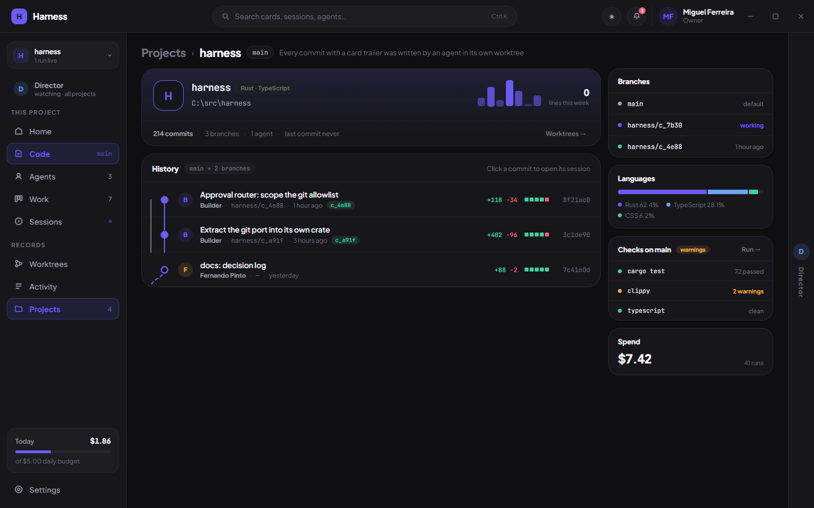

# Harness

Desktop orchestrator for Claude Code agents. You point it at git repositories,
describe what should happen, and a crew of agents does the work — each card in
its own worktree, with a Director that reads every finished diff before it
reaches you.

Stack: **Tauri 2 (Rust) + React** · Claude Code via **Node sidecar + Agent SDK**
(with the `claude` command line as a fallback).



## Layout

```
crates/
  domain/               card state machine, events, board. Zero IO.
  ports/                GitPort, AgentPort, StorePort, RunLogPort, ClockPort
  engine/               single-writer actor: intent -> decide -> persist -> broadcast
                        lib.rs (actor) · runs.rs (run lifecycle) · director.rs (review + chat)
  app/                  everything the app knows that needs no window:
                        app-data layout, settings, agent profiles, approval router,
                        project registry, checks, derived numbers. Fully unit tested.
  adapters/
    store-jsonl/        append-only event log + per-run transcripts, torn-write safe
    git/                worktrees, commits w/ trailers, diffs, history, languages
    model-claude/       AgentPort over the claude CLI (option A)
    agent-sidecar/      AgentPort over the Node sidecar + Agent SDK (option B, default)
src-tauri/              the shell only: IPC commands, one engine per project, sidecar staging
sidecar/                Node process hosting @anthropic-ai/claude-agent-sdk
src/                    React frontend: a projection of backend snapshots and events
docs/                   founding spec, decision log, screenshots
```

## Run it

Prereqs: Rust toolchain, Node >= 20, pnpm, git, Claude Code logged in (`claude`, then `/login`).

```
pnpm install
cd sidecar && pnpm install && cd ..
pnpm tauri dev
```

To build a runnable app: `pnpm tauri build` (add `--no-bundle` to skip the
installers and just produce `target/release/harness.exe`).

**Always go through `pnpm tauri`.** A plain `cargo build` — debug or release —
produces a binary that still points its webview at the dev server
(`build.devUrl`), so running it without Vite gives you an
`ERR_CONNECTION_REFUSED` page instead of the app. Only `tauri build` embeds
`dist/` into the binary.

The dev server port lives in two places that must agree: `PORT` in
`vite.config.ts` and `build.devUrl` in `src-tauri/tauri.conf.json`. It is 1751
rather than Tauri's default 1420 so two Tauri projects do not fight over it, and
Vite runs with `strictPort: true` — if the port is taken it fails loudly instead
of drifting to the next one, which would otherwise point the window at whatever
else is serving there. A built app uses no port at all: the frontend is served
from the `tauri://localhost` custom protocol.

## Where things live

Nothing is written next to the binary or inside your repositories. Everything is
under the OS app-data directory (`%APPDATA%\com.harness.app` on Windows):

```
settings.json                     operator settings
agents.json                       the crew
projects.json                     registered repositories
sidecar/                          the staged sidecar + its node_modules
projects/<id>/events.jsonl        that project's event log
projects/<id>/runs/<run>.jsonl    the transcript of every run
projects/<id>/checks.json         configured checks and their last result
worktrees/<id>/<card>/            per-card checkouts, outside the repository
```

In development the checked-out `sidecar/` directory is used directly. In an
installed build the script ships as a bundled resource, is copied into app data
on first start, and Settings can install its dependencies there.

## How it works

- **The frontend holds no truth.** It sends intents (`create_card`, `start_run`,
  `approve_card`, …) and renders snapshots. When the engine broadcasts an event
  it re-reads the snapshot rather than replaying domain rules in TypeScript.
- **One engine per project.** Each is a single-writer actor owning its board;
  agent runs happen in spawned tasks that report back through the same queue.
- **A run gets a worktree.** `harness/<card>` branch, created under app data.
  Completion commits with `Harness-Card` / `Harness-Run` / `Harness-Agent`
  trailers — which is how per-agent line counts and per-card history are read
  back out of git. Cancel or failure leaves a `wip:` commit.
- **The Director can act.** It holds Harness's own tools — create, move, approve,
  send back or delete a card, read a diff, and open a screen in your window.
  Anything that *changes* the board reaches your permission sheet first; showing
  you a screen and reading a diff do not, because they change nothing.
- **Runs stream.** The sidecar asks the SDK for partial messages, so answers
  arrive in pieces as they are written, and tool calls show as progress while an
  agent works. Reasoning streams too where the model emits it — measured: Haiku
  does, Sonnet and Opus currently do not. Deltas are live only; the transcript
  keeps the finished text.
- **One Director, two scopes.** It is a workspace-level identity: asking it
  something hands it every board at once, and it runs inside the project you
  have open so it can read that code. Reviewing a finished diff happens inside
  that project's engine, where the worktree is.
- **Local git is enough.** No remote, no account. `git init`, local commits,
  local worktrees; nothing leaves the machine unless an agent asks you for
  permission to push.
- **Agent profiles are policy.** Model, capabilities, budget, where it works
  (per card / shared / read-only) and who reviews it (Director / you / nobody)
  are resolved into a `RunProfile` at the moment a run starts. The engine itself
  carries no policy.
- **Permission requests are end-to-end.** The agent adapter mints the request id,
  the UI answers with that same id. "Stop asking me about X" becomes a standing
  allowance in settings.
- **Closing the window is graceful.** Running agents are cancelled and their
  work in progress committed before the window goes away.





## Screens

The frontend is a transcription of `Harness v4.dc.html`: tokens and keyframes
live in `src/styles/theme.css`, everything else carries the design's own inline
styles so a screen can be read side by side with the design file.

| Screen | What it is for |
| --- | --- |
| Home | What is running, what needs you, today's spend, one field to add work |
| Code | The project's commit graph, branches, languages and checks |
| Agents | The crew; opening one slides up its profile drawer |
| Work | The board: Later, Ready, Working, Review, Done — with drag and drop |
| Sessions | Every recorded run and its transcript, replayed from disk |
| Worktrees | The checkouts that exist right now, and a way to drop them |
| Activity | The event log, filterable, newest first |
| Projects | Every repository Harness is allowed to touch |
| Director | What it decided, its policy toggles, its standing brief |
| Settings | How agents run, allowances, appearance, auth, where data lives |

Ctrl+K opens a palette over every screen, project, agent and card.

## Tests

```
cargo test --workspace    # domain, engine, adapters, app core
npx tsc --noEmit          # the frontend
node sidecar/smoke.mjs    # live end-to-end against your Claude login
```

The Tauri crate itself holds no testable logic on purpose — a `cdylib` cannot run
unit tests on Windows, so everything worth asserting lives in `crates/app`.

See `docs/SPEC-ORIGINAL.md` for the founding architecture document and
`docs/DECISIONS.md` for every deviation and decision since.
